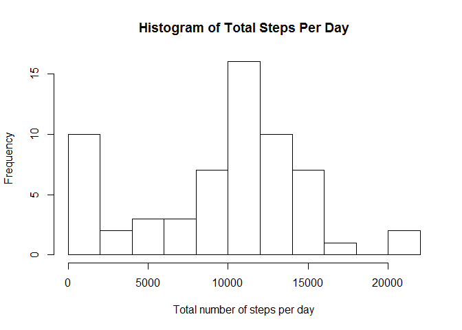

#Reproducible Research Course Project 1
Catherine Howell

1. Download the activity data and read into a data frame

```r
fileURL <- "https://d396qusza40orc.cloudfront.net/repdata%2Fdata%2Factivity.zip"
download.file(fileURL, destfile = "actData.zip")
actData<-read.csv(unzip("actData.zip"))
```

2. Calculate the total steps per day and display a histogram

```r
sumSteps<-by(actData["steps"],actData["date"],sum,na.rm=T)
hist(sumSteps,xlab="Total number of steps per day", breaks=10,main = "Histogram of Total Steps Per Day")
```

<!-- -->

3. Calculate mean and median number of steps per day.

```r
meanSteps<-mean(sumSteps)
medSteps <-median(sumSteps)
```

4. Calculate and plot the average number of steps per 5-minute interval

```r
intSteps <-by(actData$steps,actData$interval,mean,na.rm=T)
plot(names(intSteps),intSteps,type="l",xlab="Time interval",ylab="Average number of steps per interval", main="Average Steps Per 5-Minute Interval")
```

<!-- -->

5. Find the 5 minute interval containing the maximum number of steps, on average.

```r
maxSteps<-intSteps[which.max(intSteps)]
names(maxSteps)
```

```
## [1] "835"
```

6. Impute missing data by replacing NA values with the median number of steps for that interval.
I chose the median rather than the mean because I considered there to be a qualitative difference between walking and not-walking.


```r
imputedSteps<-function(actSteps,actInt){
  if(is.na(actSteps)){
    imp<-median(actData[which(actData$interval==actInt),1],na.rm =T)
  }
  else{
    imp<-actSteps
  }
  imp
}
actData$impSteps<-mapply(imputedSteps,actData$steps,actData$interval)
```

7. Create a histogram of total steps per day, imputing missing values.

```r
sumImpSteps<-by(actData["impSteps"],actData["date"],sum,na.rm=T)
hist(sumImpSteps,xlab="Total number of steps per day, imputed missing data", breaks=10, main="Histogram of Total Steps Per Day, with Imputed Data", sub="By Median Number of Steps By Interval")
```

<!-- -->

8. Compare Average Number of steps per interval across weekdays and weekends.

```r
library(ggplot2)
actData$day <- weekdays(strptime(actData$date,format="%Y-%m-%d"))
isWeekend <-function(day){
  if(day %in% c("Saturday","Sunday")){
    "Weekend"
  }
  else{
    "Weekday"
  }
}
actData$dateType <- sapply(actData$day, isWeekend)
meanSteps<-aggregate(actData$impSteps, by=c(actData["interval"],actData["dateType"]),FUN=mean)
qplot(data=meanSteps,x=interval, y=x, facets=dateType ~ .,geom="line",ylab = "Mean Number of Steps", main="Average Steps per Interval, Weekend vs. Weekday")
```

<!-- -->
